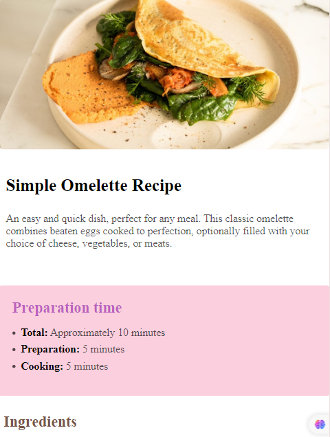

# Recipe Page

Simple omelette recipe is an An easy and quick dish, perfect for any meal. This classic omelette combines between eggs cooked to perfection, optionally filled with your choice of cheese, vegetables, or meats

<br>
<br>
<a href="https://youtubeclone1123.netlify.app/">
  
</a>

<br>

## Live Site:

- Link: https://youtubeclone1123.netlify.app/

## Features

- Responsevie Layout: use media queries for all screens to make app responseve.
- Build instructions componet to lead you the instraction of the product with order list.
- Build nutrition component to show the amount of Calories, Carbs, Protein and Fat by table.

## Technologies

Project is created with:

- HTML
- CSS
- Responsevie Layout
- Media Queries

### What I learned

The best thing i learned from this project how to use table in the project and how to add css to table to get the specific as you see in the code below.

```html
<table>
  <tr class="border-bottom">
    <td>Calories</td>
    <td class="text-red">277kcal</td>
  </tr>
  <tr class="border-bottom">
    <td>Carbs</td>
    <td class="text-red">0g</td>
  </tr>
  <tr class="border-bottom">
    <td>Protein</td>
    <td class="text-red">20g</td>
  </tr>
  <tr>
    <td>Fat</td>
    <td class="text-red">22g</td>
  </tr>
</table>
```

```css
.container .head-nut table {
  border-collapse: collapse;
  margin-top: 20px;
  font-size: 20px;
  width: 100%;
  height: 100%;
}

.container .head-nut table tr.border-bottom {
  border-bottom: 2px solid #9e9e9e63;
}
.container .head-nut table td {
  padding: 15px;
}
.container .head-nut table td.text-red {
  color: #795548;
}
```

## Author

- Website - [Ahmed Rafat](https://ahmed-abo-rafat.github.io/Portfolio/)
- Linked In - [Ahmed Rafat](https://www.linkedin.com/in/ahmed-rafat-a489301a2/)
- Gmail - [Ahmed Rafat](https://mail.google.com/mail/u/1/#inbox)
- Phone - (01060843933)
